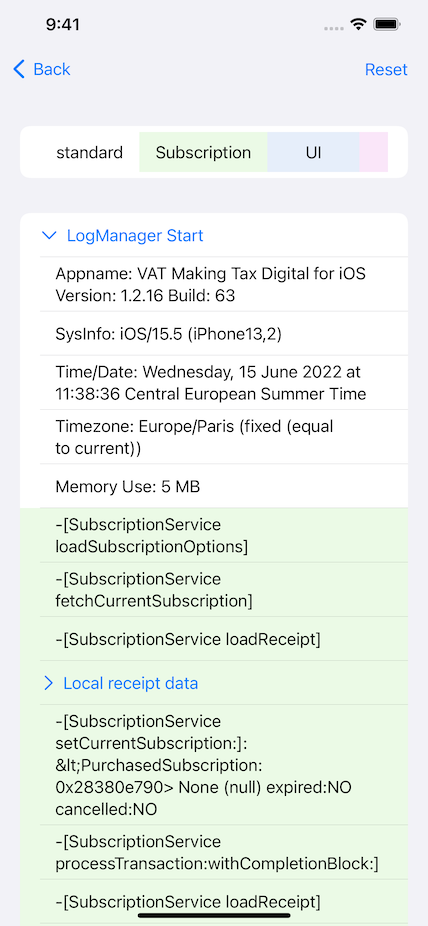
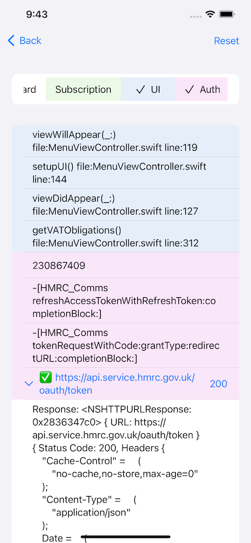

# Log Viewer

Very simply, Log Viewer allows the opening of html files in iOS.

If you ever get emailed an html file you need to view, the iOS Quick Look can sometimes help but Javascript is disabled in Quick Look.
You can either use a document app to save the document then open it, or simply use the Share Sheet to share the html file with this Log Viewer app which will load the html into a WKWebView with Javascrip enabled.

When used in combination with the [DJLogging](https://github.com/ddaddy/DJLogging-Swift) iOS/MacOS logging framework your logs become super easy to read on an iOS device. You will have the option of viewing the full html file or a parsed table of the logs.

 